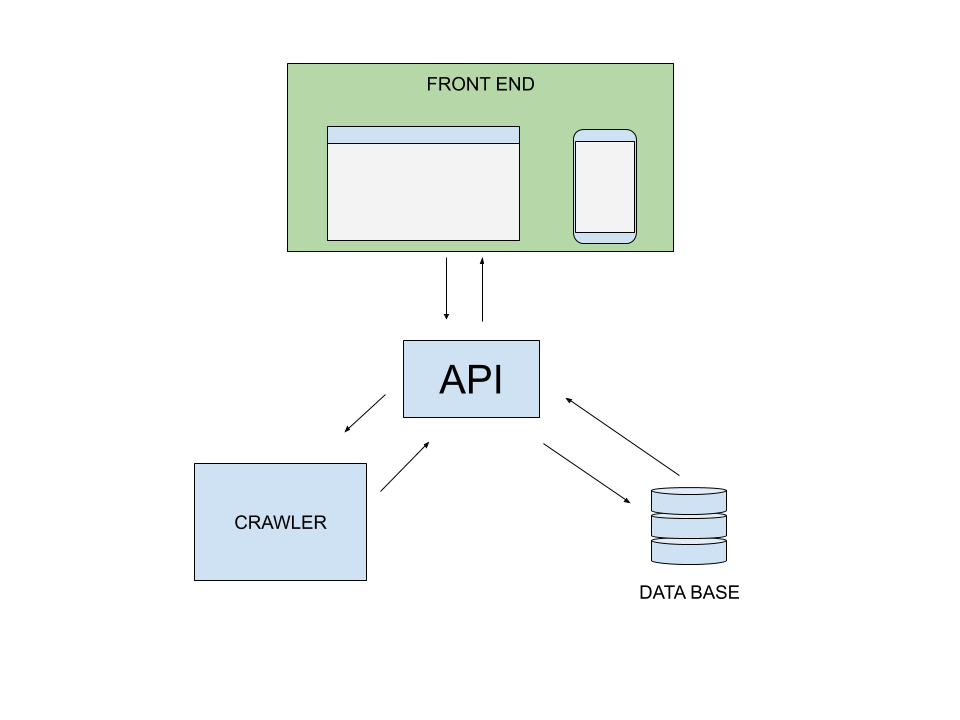
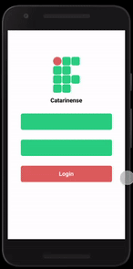

# CSIGAA

## CSIGAA ==> Crawler do Sistema Integrado de Gestão de Atividades Acadêmicas

## Objetivos
- O sistema deve possuir um webcrawler que recebe como parametro o usuario e senha do aluno.
- O crawler deve coletar informações como frequencia, notas, atividades pendentes, calendario academico, noticias.
- O sistema deve armazenar as informações coletadas de modo que possa servir estes dados em formato JSON

- Criar interfaces para visualização organizada das informações coletadas ( app mobile , interface web, app desktop, etc. )

## Visão geral

## Crawler 
Para executar o atual crawler você precisa:
- 1 - ter o node.js instalado na sua maquina
- 2 - clone o repositorio 
- 3 - rode o seguinte comando na pasta rais do crawler " npm install "

Para executar rode o comando " npm start "

## App 
 - Primeiro prototipo de app
 
 - Algumas funcionalidades do app
 - [x] ver notas
 - [x] ver presença
 - [ ] ver atividades pendentes
 - [ ] ver notícias

## Contribuições
Todo tipo de contribuição é bem vinda.
- pull requests
- correção de bugs
- testes
- ideias de funcionalidades
- ideias de design para o front end ( pagina web ou aplicativo mobile )
- opiniões
